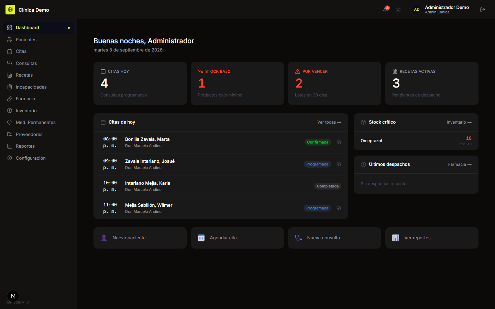
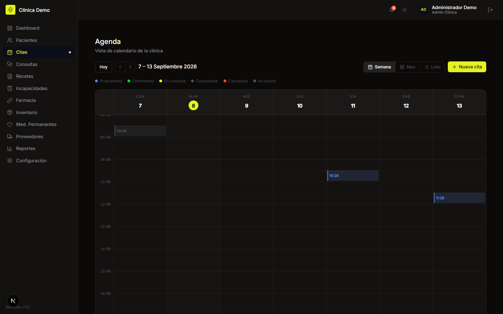
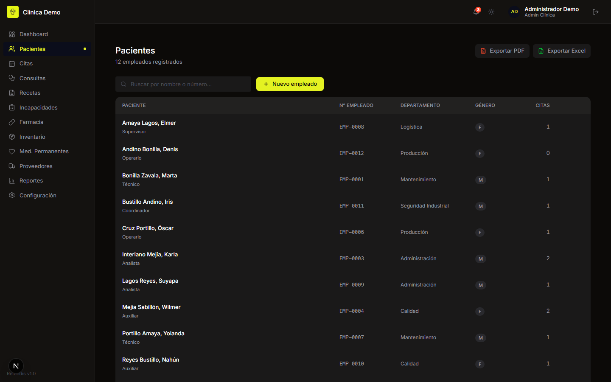
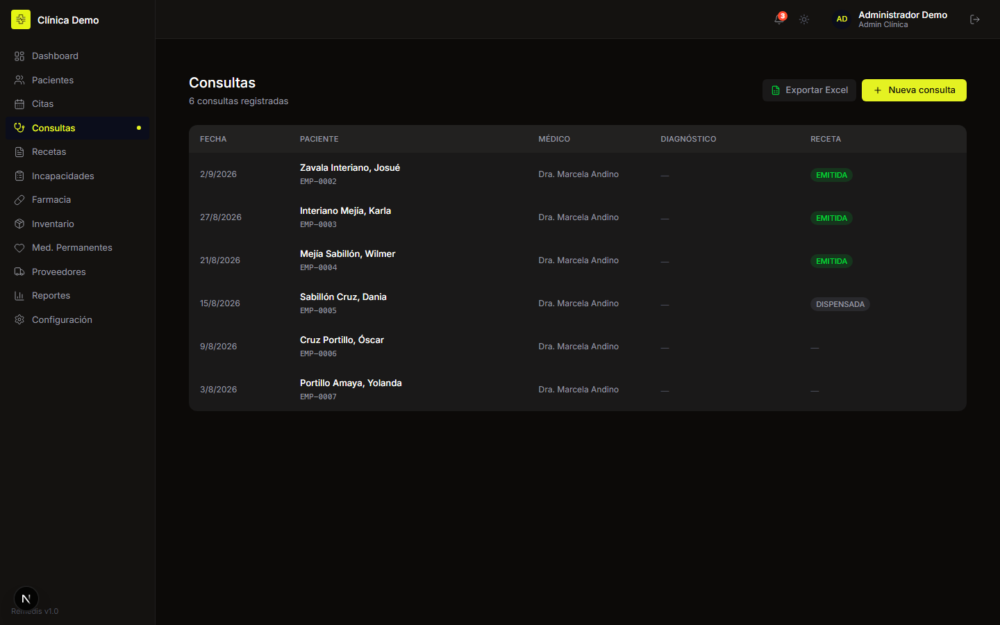
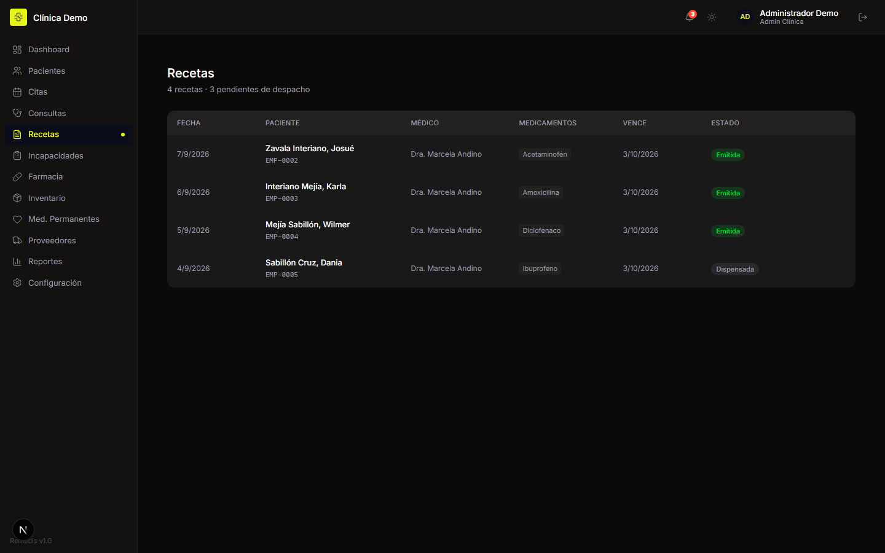
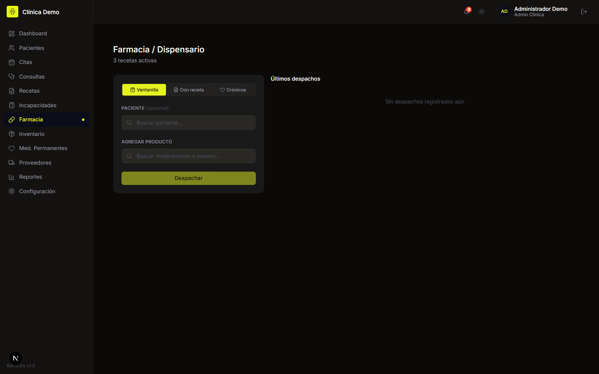
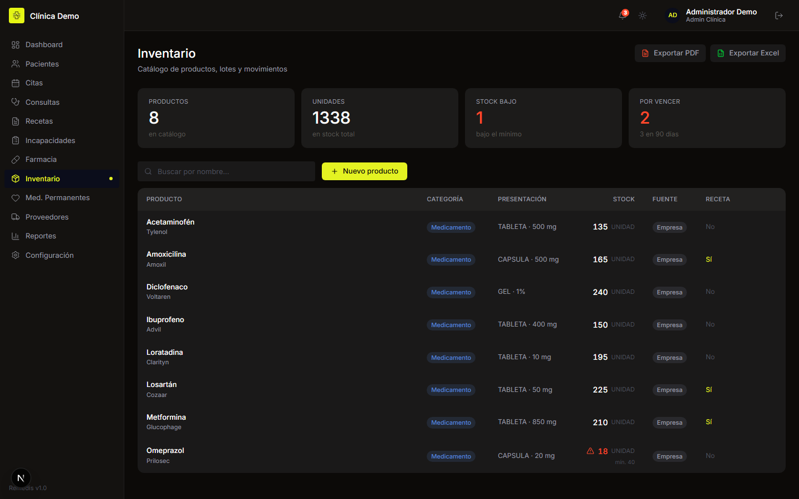
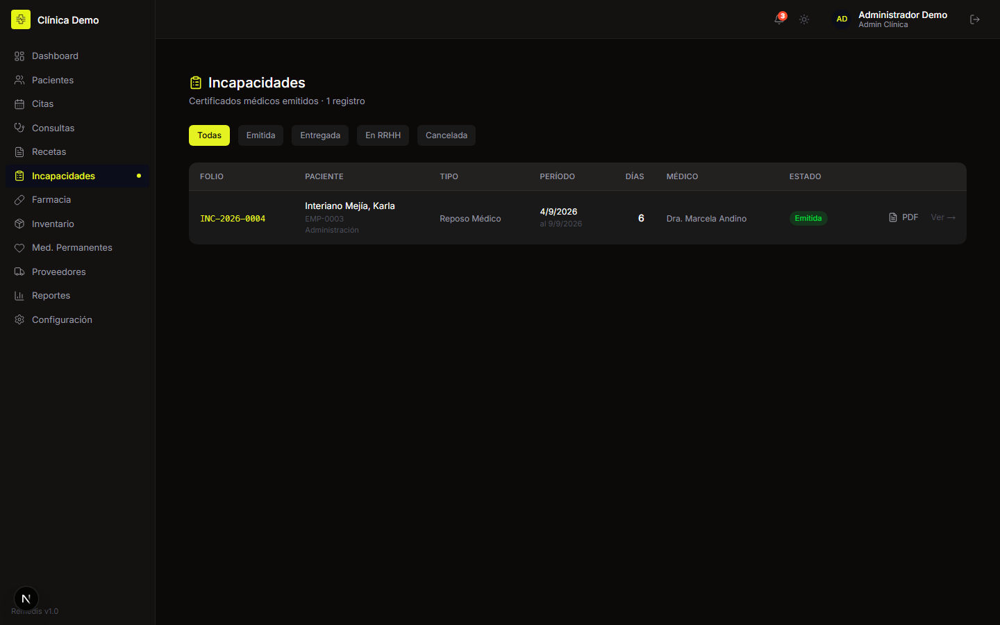
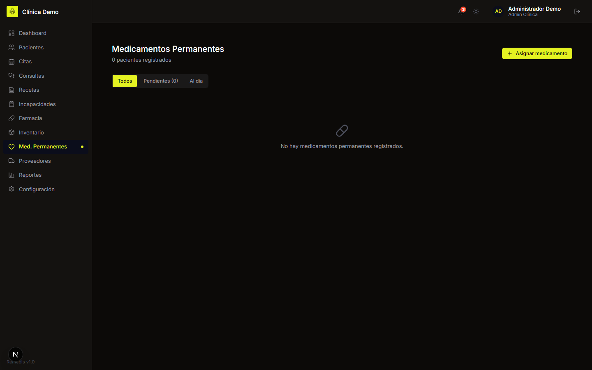

<div align="center">

# Remedis

### Sistema de gestión clínica para clínicas de empresa

### [🩺 remedis.brandsofts.com](https://remedis.brandsofts.com/)

[](LICENSE)
[](https://nodejs.org/)
[](https://nextjs.org/)
[](https://www.postgresql.org/)

Expediente médico de empleados y sus dependientes, agenda, recetas,
incapacidades y farmacia con inventario por lotes — con cada empresa aislada
en su propio espacio.



</div>

## Qué resuelve

Una clínica dentro de una empresa atiende a una población conocida —los
empleados y sus dependientes— y arrastra dos problemas que los sistemas
clínicos genéricos no cubren:

- **La farmacia tiene dos dueños.** Parte del medicamento lo compra la empresa
  y parte llega del seguro social. Hay que despacharlo y reportarlo por
  separado, aunque salga del mismo mostrador.
- **La incapacidad es un trámite, no una nota.** Sale de una consulta, lleva
  folio, días de reposo y restricciones, y termina en Recursos Humanos.

Remedis modela las dos cosas como entidades de primera clase, no como campos
de texto al final de un expediente.

| Módulo | Qué hace |
| --- | --- |
| **Pacientes** | Empleados y sus dependientes, con historial médico |
| **Agenda** | Citas por clínica y médico, con estados |
| **Consultas** | Expediente en formato SOAP con signos vitales y diagnósticos |
| **Recetas** | Emisión digital, con seguimiento de lo dispensado |
| **Incapacidades** | Folio, días, restricciones y recomendaciones; distingue las del IHSS |
| **Farmacia** | Despacho contra receta, descontando del lote correcto |
| **Inventario** | Lotes con caducidad, stock mínimo y alertas de vencimiento |
| **Medicamentos permanentes** | Tratamientos crónicos con entregas periódicas |
| **Proveedores y compras** | Órdenes de compra y recepciones |
| **Reportes** | Indicadores de atención, consumo y existencias |
| **Multiempresa** | Cada empresa con sus clínicas, almacenes y usuarios |

## Cómo se ve

### Agenda y pacientes

<table>
<tr>
<td width="50%"></td>
<td width="50%"></td>
</tr>
<tr>
<td><b>Agenda</b> — citas del día por médico</td>
<td><b>Pacientes</b> — empleados y dependientes</td>
</tr>
<tr>
<td></td>
<td></td>
</tr>
<tr>
<td><b>Consultas</b> — expediente SOAP y signos vitales</td>
<td><b>Recetas</b> — emitidas y su despacho</td>
</tr>
</table>

### Farmacia e inventario

El inventario avisa de lo que está por vencer y de lo que bajó del mínimo,
que es donde una clínica pequeña pierde dinero sin darse cuenta.

<table>
<tr>
<td width="50%"></td>
<td width="50%"></td>
</tr>
<tr>
<td><b>Farmacia</b> — despacho contra receta</td>
<td><b>Inventario</b> — lotes, caducidad y mínimos</td>
</tr>
<tr>
<td></td>
<td></td>
</tr>
<tr>
<td><b>Incapacidades</b> — folio, días y restricciones</td>
<td><b>Permanentes</b> — tratamientos crónicos</td>
</tr>
</table>

> Las capturas salen de una instancia local con **datos clínicos inventados**:
> ninguna persona, diagnóstico ni expediente corresponde a nadie real.

## Tecnologías

| Área | Tecnología |
| --- | --- |
| Aplicación | Next.js 15 (App Router), React, TypeScript |
| Base de datos | PostgreSQL con Prisma |
| Sesión | Auth.js con roles por módulo |
| Archivos | MinIO / S3 |
| Correo | Resend |
| Suscripciones | Stripe |
| Desarrollo | Docker Compose |

## Puesta en marcha

Requisitos: **Node 20+**, **pnpm** y **Docker**.

```bash
git clone https://github.com/esdrasclth/remedis.git
cd remedis
pnpm install
cp .env.example .env       # revisa los valores antes de seguir

docker compose up -d postgres
pnpm db:setup              # migraciones + seed
pnpm dev                   # http://localhost:3000
```

`pnpm db:setup` deja una **Clínica Demo** con cinco usuarios, uno por rol
—administración, medicina, enfermería, farmacia y Recursos Humanos— y sus
contraseñas se imprimen al terminar. La base nace **sin pacientes**: el
propósito del seed es poder entrar, no simular una clínica.

Los scripts de base usan `node --env-file=.env` porque la configuración de
Prisma exige las variables en el entorno, no sólo en el archivo. Si ejecutas
Prisma a mano, exporta primero:

```bash
set -a; . ./.env; set +a
```

## Estructura

```text
app/
  (admin)/admin/    consola del operador: empresas y usuarios
  (app)/            el sistema: pacientes, citas, consultas, recetas,
                    incapacidades, farmacia, inventario, reportes
prisma/             esquema, migraciones y seed
docs/capturas/      imágenes de este README
```

## Contribuir

[`CONTRIBUTING.md`](CONTRIBUTING.md) explica el entorno, el modelo de datos y
qué comprobar antes de un pull request.

## Licencia

**[GNU AGPL v3](LICENSE)**. Puedes usar, estudiar y modificar Remedis. Si lo
despliegas y das acceso a otras personas por red, tienes que publicar tu
versión del código con la misma licencia.
